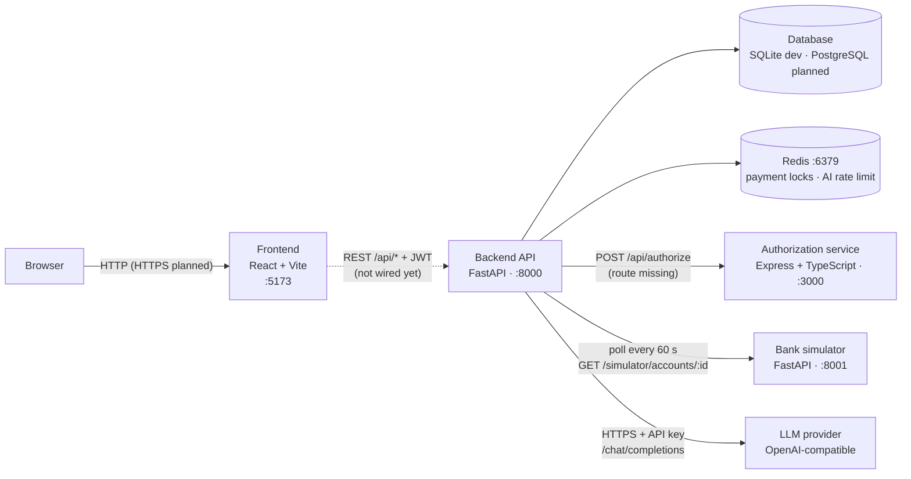
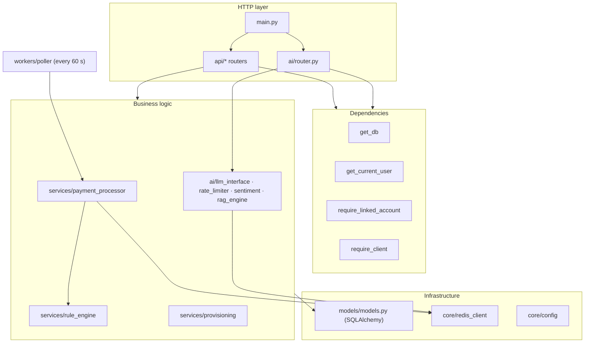
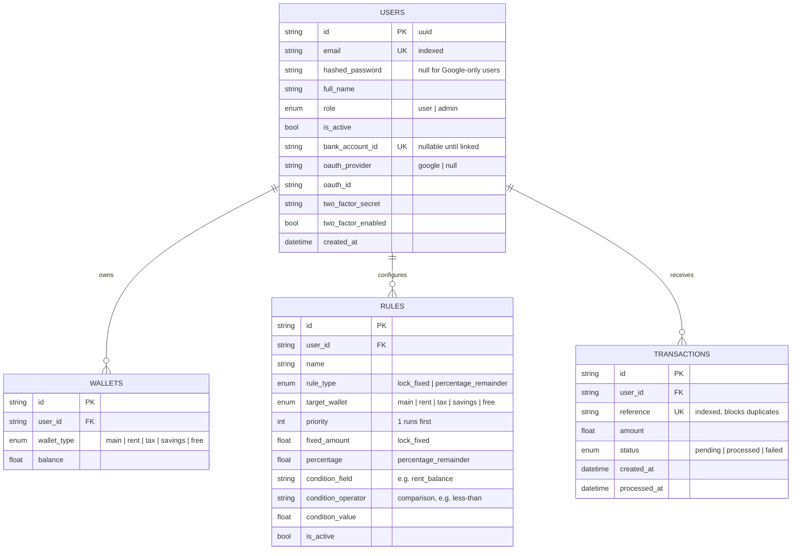
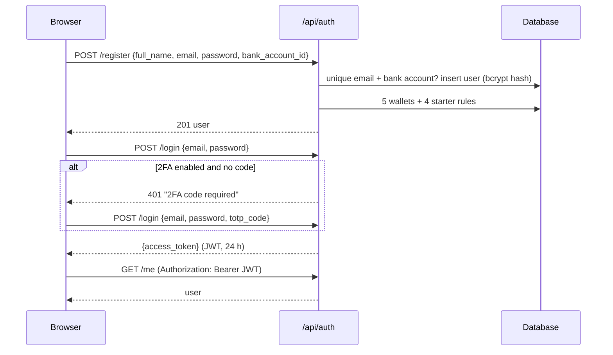
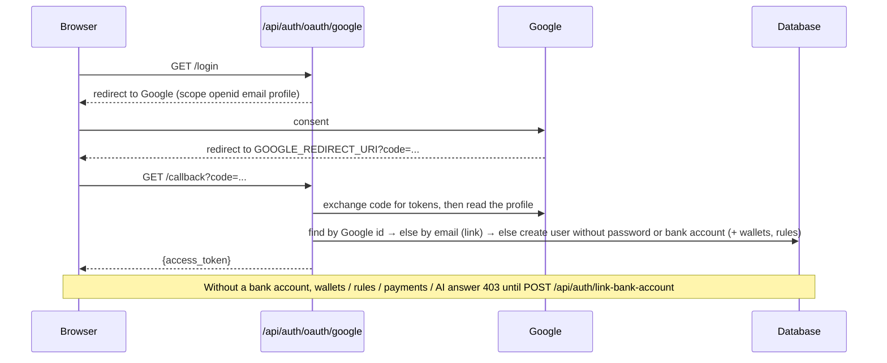
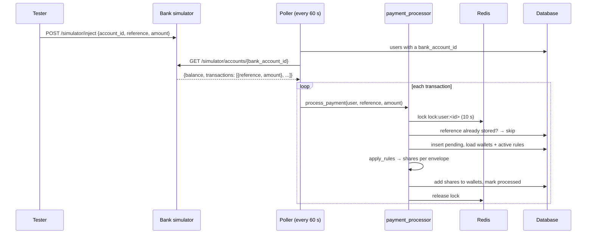
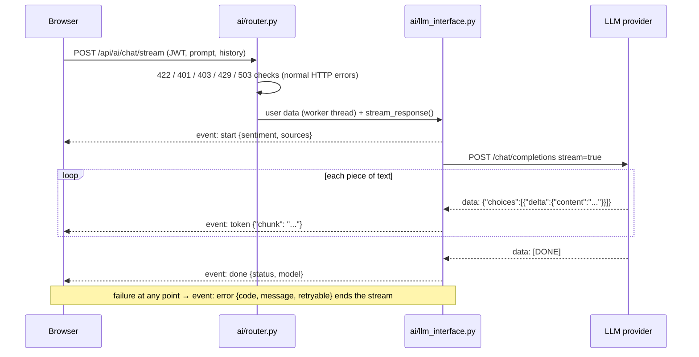

# AutoWallet — Architecture

State of the code on branch `feature/ai-integration` (September 23, 2026): `main` plus the AI assistant in `backend/app/ai`.
Status marks: ✅ works · 🟡 partial or planned · ❌ empty placeholder / missing.

---

## 1. What AutoWallet is

An automatic budgeting engine for freelancers. When a payment arrives on the user's bank account, AutoWallet splits it at once into five envelopes — **main, rent, tax, savings, free** — by rules the user configures once. It is a ledger: it records how money should be divided; it never moves real money. Payments come from a **bank simulator** in this version. An **AI assistant** answers questions about the user's money, grounded in knowledge articles and the user's own data.

---

## 2. System overview



| Component | Folder | Tech | Port | Status |
|---|---|---|---|---|
| Frontend | `frontend/` | React 19, Vite 8, TypeScript, Tailwind CSS 4, React Router 7, lucide-react | 5173 (dev) | 🟡 Login / sign-up screen only, not connected to the API |
| Backend API | `backend/` | Python 3.14, FastAPI, SQLAlchemy 2, Alembic, Pydantic 2, APScheduler | 8000 | ✅ Auth, 2FA, Google OAuth, wallets, rules (read), transactions, poller, AI |
| AI assistant | `backend/app/ai/` | FastAPI router + httpx client to an OpenAI-compatible LLM, NumPy TF-IDF | inside the backend | ✅ Backend done (see §10) |
| Authorization service | `authorization/` | Node.js, Express 5, TypeScript, jsonwebtoken | 3000 | 🟡 Only `GET /api/health`; JWT middleware written but not mounted |
| Bank simulator | `bank-simulator/` | FastAPI, in-memory | 8001 | ✅ Inject / read payments |
| Database | — | SQLite (`flowpay.db`) in dev; PostgreSQL supported by `psycopg2` + entrypoint | 5432 (planned) | ✅ via SQLAlchemy |
| Redis | — | Redis 7 | 6379 | ✅ Locks + AI rate limit |
| Orchestration | `docker-compose.yml` | Docker Compose | — | ❌ empty file |
| CI | `.github/workflows/ci.yml` | GitHub Actions | — | ❌ empty file |

---

## 3. Repository layout (every file)

```
AutoWallet/
├── README.md                         project README (42 required sections)
├── CONTRIBUTING.md                   team workflow: branches, PRs, migrations, file ownership
├── .gitignore                        ignores .env, venv, *.db, node_modules …
├── docker-compose.yml                ❌ empty — single-command deployment still to write
├── setup-authorization.sh            one-off script: npm init + install deps for authorization/
├── .github/workflows/ci.yml          ❌ empty — CI pipeline still to write
├── docs/
│   └── architecture.md               this document
│
├── backend/                          FastAPI application (the core API)
│   ├── Dockerfile                    python:3.14-slim, installs requirements, runs entrypoint.sh
│   ├── entrypoint.sh                 waits for PostgreSQL (if used) → alembic upgrade head → uvicorn :8000
│   ├── requirements.txt              pinned Python dependencies (FastAPI, SQLAlchemy, redis, PyJWT, numpy …)
│   ├── .env.example                  every setting with safe example values
│   ├── alembic.ini                   Alembic config (URL is injected from settings in env.py)
│   ├── alembic/
│   │   ├── env.py                    uses settings.database_url + Base.metadata, render_as_batch=True (SQLite ALTER)
│   │   ├── script.py.mako            template for new migrations
│   │   ├── README                    Alembic boilerplate
│   │   └── versions/
│   │       ├── a01c0e893ff5_create_initial_tables.py              users, rules, transactions, wallets (2026-08-11)
│   │       ├── f0bae97fb421_add_bank_account_id_to_users.py       bank_account_id NOT NULL + unique (2026-08-13)
│   │       └── a40936c66554_make_bank_account_id_nullable_for_oauth_.py   nullable for Google users (2026-09-18)
│   ├── app/
│   │   ├── __init__.py
│   │   ├── main.py                   creates the FastAPI app, includes routers, /health, starts the poller
│   │   ├── api/                      HTTP routers (one file per feature)
│   │   │   ├── __init__.py
│   │   │   ├── schemas.py            Pydantic request/response models for auth, wallets, rules, transactions
│   │   │   ├── auth.py               /api/auth: register, login (+2FA code), me, 2FA setup/verify, link bank account
│   │   │   ├── oauth.py              /api/auth/oauth/google: login redirect + callback
│   │   │   ├── wallets.py            /api/wallets: list the 5 envelopes
│   │   │   ├── rules.py              /api/rules: list rules by priority
│   │   │   └── transactions.py       /api/transactions: create a payment, list payments
│   │   ├── core/                     shared infrastructure
│   │   │   ├── __init__.py
│   │   │   ├── config.py             Settings (pydantic-settings) read from backend/.env
│   │   │   ├── database.py           SQLAlchemy engine, SessionLocal, Base, get_db dependency
│   │   │   ├── security.py           bcrypt hashing, JWT create/decode (HS256, 24 h), TOTP helpers (pyotp)
│   │   │   ├── deps.py               get_current_user (401), require_linked_account (403)
│   │   │   ├── auth_client.py        require_client: asks the authorization service for "client:access"
│   │   │   └── redis_client.py       one Redis client built from REDIS_URL
│   │   ├── models/
│   │   │   ├── __init__.py
│   │   │   └── models.py             ORM tables: User, Wallet, Rule, Transaction + enums
│   │   ├── services/                 business logic, no HTTP
│   │   │   ├── __init__.py
│   │   │   ├── rule_engine.py        apply_rules(): pure function that splits an amount
│   │   │   ├── provisioning.py       creates the 5 wallets + 4 starter rules for a new user
│   │   │   └── payment_processor.py  process_payment(): Redis lock → dedupe → split → update wallets
│   │   ├── workers/
│   │   │   ├── __init__.py
│   │   │   └── poller.py             APScheduler job: pulls payments from the bank simulator every 60 s
│   │   ├── scripts/
│   │   │   ├── __init__.py
│   │   │   └── seed.py               ❌ empty
│   │   └── ai/                       AI assistant — owner mtarza (details in §10)
│   │       ├── __init__.py           folder map
│   │       ├── README.md             module claims, subject mapping, setup, endpoints, evaluation script
│   │       ├── ai-assistant.excalidraw   the whole AI part on one diagram board
│   │       ├── router.py             /api/ai endpoints + access checks
│   │       ├── llm_interface.py      prompt building, LLM calls, streaming, error mapping
│   │       ├── rate_limiter.py       per-user sliding-window limit (Redis, memory fallback)
│   │       ├── sentiment.py          mood of each chat message
│   │       ├── rag_engine.py         TF-IDF search over the knowledge articles + context builder
│   │       ├── knowledge_base.py     12 knowledge articles
│   │       └── schemas.py            AI request/response models
│   └── tests/                        pytest suite (QA team)
│       ├── __init__.py
│       ├── conftest.py               in-memory SQLite, fakeredis, poller disabled, client/user/token fixtures
│       ├── test_auth.py              15 tests — register, login, JWT, 2FA
│       ├── test_rule_engine.py       16 tests — priorities, conditions, remainder to main
│       ├── test_transactions.py      8 tests — payments, duplicates, concurrency, scoping
│       ├── test_oauth.py             12 tests — Google login, linking, unlinked-account gate
│       ├── test_poller.py            9 tests — simulator polling, errors, idempotency
│       └── test_concurrency.py       ❌ empty
│
├── bank-simulator/                   fake bank used instead of a real banking API
│   ├── main.py                       POST /simulator/inject, GET /simulator/accounts/{id} (in memory)
│   ├── requirements.txt              fastapi, uvicorn, pydantic
│   ├── Dockerfile                    ❌ empty
│   └── tests/
│       ├── conftest.py               puts main.py on the import path
│       └── test_simulator.py         9 tests
│
├── authorization/                    role/permission service (Express + TypeScript)
│   ├── package.json / package-lock.json   express 5, jsonwebtoken, cors, cookie-parser, dotenv; tsx, typescript
│   ├── tsconfig.json                 strict TypeScript, src → dist
│   ├── .gitignore
│   └── src/
│       ├── server.ts                 loads .env, listens on PORT (3000)
│       ├── app.ts                    express.json() + mounts routes under /api
│       ├── routes/authorization.routes.ts   GET /api/health
│       ├── middleware/authenticate.ts        verifies Bearer JWT with JWT_SECRET → req.user {id, role} (not mounted yet)
│       ├── middleware/authorize.ts           ❌ empty
│       ├── services/authorization.service.ts ❌ empty
│       └── types/express.d.ts        adds req.user to Express' Request type
│
└── frontend/                         React single-page app
    ├── index.html                    HTML shell, favicon AW.svg
    ├── package.json / package-lock.json   react 19, react-router-dom 7, lucide-react, tailwind 4, vite 8
    ├── vite.config.ts                React + Tailwind plugins (no API proxy yet)
    ├── tsconfig.json / tsconfig.app.json / tsconfig.node.json   TypeScript configs
    ├── eslint.config.js              ESLint (TS, React hooks, React refresh)
    ├── .gitignore
    ├── README.md                     Vite template README
    ├── Dockerfile                    ❌ empty
    ├── public/
    │   ├── AW.svg                    logo (a PNG embedded in an SVG, 650 KB)
    │   └── login-desk-hero.png       isometric illustration of the login page
    └── src/
        ├── main.tsx                  React root
        ├── App.tsx                   router: "/" login + sign-up page, "/maintenance" placeholder
        ├── icons.tsx                 Google and GitHub brand icons
        └── index.css                 Tailwind import + brand colour tokens (@theme)
```

---

## 4. Backend (FastAPI)

### 4.1 Layers



Rules of the code base (from `CONTRIBUTING.md`): one router file per feature, `main.py` only gains `include_router` lines, every `models.py` change ships with an Alembic migration.

### 4.2 Startup — `app/main.py`

1. Creates `FastAPI(title="AutoWallet")`.
2. Includes the routers: auth, transactions, wallets, rules, oauth, ai.
3. `GET /health` → `{"status": "ok"}`.
4. On startup, starts the APScheduler `BackgroundScheduler` that runs the bank poller (guarded against double start).

Swagger documentation of every route is generated at `/docs`.

### 4.3 Configuration — `app/core/config.py`

`Settings` (pydantic-settings) reads `backend/.env`. It **rejects keys it doesn't declare**, so every variable used anywhere in the backend must be listed here.

| Setting | Required | Default | Used by |
|---|---|---|---|
| `DATABASE_URL` | yes | — | database.py, Alembic |
| `SECRET_KEY` | yes | — | JWT signing |
| `REDIS_URL` | yes | — | redis_client.py |
| `BANK_SIMULATOR_URL` | yes | — | poller.py |
| `POLL_INTERVAL_SECONDS` | no | 60 | poller.py |
| `GOOGLE_CLIENT_ID` / `GOOGLE_CLIENT_SECRET` / `GOOGLE_REDIRECT_URI` | yes | — | oauth.py |
| `OPENAI_API_KEY` | no | empty → AI answers 503 | ai/llm_interface.py |
| `OPENAI_BASE_URL` | no | `https://api.openai.com/v1` | ai/llm_interface.py |
| `AI_MODEL` | no | `gpt-4o-mini` | ai/llm_interface.py |
| `AI_RATE_LIMIT_PER_MINUTE` | no | 20 | ai/rate_limiter.py |
| `AI_REQUEST_TIMEOUT_SECONDS` | no | 30 | ai/llm_interface.py |
| `AI_MAX_OUTPUT_TOKENS` | no | 800 | ai/llm_interface.py |

### 4.4 Database access — `app/core/database.py`

`create_engine(DATABASE_URL)` (with `check_same_thread=False` for SQLite) → `SessionLocal` (autocommit off, autoflush off) → `get_db()` yields one session per request and closes it afterwards. `Base` is the declarative base every model inherits from.

### 4.5 Security

| Piece | Where | How |
|---|---|---|
| Passwords | `core/security.py` | bcrypt via passlib (`hash_password`, `verify_password`); never stored in clear |
| Access token | `core/security.py` | JWT HS256 signed with `SECRET_KEY`, payload `{"sub": user_id, "exp": now + 24 h}` |
| Reading the token | `core/deps.get_current_user` | `Authorization: Bearer <JWT>` → decode → load the user; missing/invalid/expired → **401** |
| Bank-account gate | `core/deps.require_linked_account` | users without `bank_account_id` (Google sign-ups) → **403** "Please link a bank account before continuing" |
| Client permission | `core/auth_client.require_client` | POST `http://authorization:3000/api/authorize` `{"permission": "client:access"}` with the user's token; 401/403 passed on; unreachable or other → **503** |
| Two-factor | `core/security.py` + `api/auth.py` | TOTP (pyotp): random base32 secret, provisioning URI with issuer "AutoWallet", codes accepted ±1 time step |
| Google login | `api/oauth.py` | OAuth 2.0 authorization-code flow, scope `openid email profile` |
| Secrets | `backend/.env` | ignored by git; `.env.example` holds placeholders |

### 4.6 API endpoints

| Method & path | Access | Request → Response | Errors |
|---|---|---|---|
| `GET /health` | public | → `{"status": "ok"}` | — |
| `POST /api/auth/register` | public | `{full_name 2–100, email, password ≥ 8, bank_account_id 3–50}` → 201 `{id, full_name, email, bank_account_id}`; creates 5 wallets + 4 rules | 400 email exists · 400 bank account taken · 422 |
| `POST /api/auth/login` | public | `{email, password, totp_code?}` → `{access_token, token_type: "bearer"}` | 401 wrong credentials · 401 "2FA code required" · 401 invalid code |
| `GET /api/auth/me` | JWT | → `{id, full_name, email, bank_account_id}` | 401 |
| `POST /api/auth/2fa/setup` | JWT | → `{secret, provisioning_uri}` (QR code content) | 401 |
| `POST /api/auth/2fa/verify` | JWT | `{code: 6 digits}` → `{"message": "2FA enabled"}` | 400 not started · 400 invalid code |
| `POST /api/auth/link-bank-account` | JWT | `{bank_account_id 3–50}` → user | 400 already linked · 400 taken by another user |
| `GET /api/auth/oauth/google/login` | public | redirect to Google's consent page | — |
| `GET /api/auth/oauth/google/callback?code=` | public | → `{access_token, token_type}` (JSON, not a redirect to the frontend yet) | 401 Google rejected the code / profile |
| `GET /api/wallets/` | client + linked | → `[{id, wallet_type, balance}]` × 5 | 401 · 403 · 503 |
| `GET /api/rules/` | linked | → rules ordered by priority | 401 · 403 |
| `POST /api/transactions/` | client + linked | `{reference 1–100, amount > 0}` → 201 `{id, reference, amount, status}` | 400 duplicate reference · 409 payment being processed · 503 |
| `GET /api/transactions/` | client + JWT | → the user's payments, newest first | 401 · 503 |
| `POST /api/ai/chat` | linked + rate limit | `{prompt, history, include_context}` → answer JSON | 401 · 403 · 422 · 429 · 502/503/504 |
| `POST /api/ai/chat/stream` | linked + rate limit | same body → Server-Sent Events | same, before the stream starts |
| `POST /api/ai/rag/query` | JWT + rate limit | `{query, top_k}` → matching articles | 401 · 422 · 429 |
| `GET /api/ai/status` | public | → `{status, model, knowledge_articles, rate_limit_per_minute, streaming_supported}` | — |

"client" = `require_client` on the router (authorization service); "linked" = `require_linked_account` (which includes the JWT check).

### 4.7 Business logic

**Provisioning — `services/provisioning.py`.** On registration (and on first Google sign-in) the user gets one wallet per type with balance 0 and four starter rules:

| Priority | Name | Type | Target | Amount | Condition |
|---|---|---|---|---|---|
| 1 | Rent lock | lock_fixed | rent | 3,500 | only if `rent_balance < 3500` |
| 2 | Tax | percentage_remainder | tax | 15 % | — |
| 3 | Savings (capped) | percentage_remainder | savings | 15 % | only if `savings_balance < 10000` |
| 4 | Free to spend | percentage_remainder | free | 100 % | — |

**Rule engine — `services/rule_engine.apply_rules(amount, rules, wallet_balances)`.** A pure function (no database), which makes it easy to test:

1. `pool = amount`; rules sorted by ascending priority.
2. Stop when the pool is empty. Skip a rule whose condition is false (`<`, `<=`, `>`, `>=`, `==` against `<wallet>_balance`); an unknown field or operator also skips it.
3. `lock_fixed` takes `min(fixed_amount, pool)`; `percentage_remainder` takes `pool × percentage / 100` — a share of what is **left**, not of the payment.
4. Add the take to the target wallet, subtract it from the pool.
5. Whatever remains goes to `main`.

Example with the starter rules and empty wallets: 8,500 → rent 3,500 (pool 5,000) → tax 750 (4,250) → savings 637.50 (3,612.50) → free 3,612.50 → main 0.

**Payment processing — `services/payment_processor.process_payment(user, reference, amount, db)`.** Shared by the API and the poller:

1. Take the Redis lock `lock:user:<user_id>` (expires after 10 s, waits up to 5 s). Not acquired → `RuntimeError` → the API answers **409**.
2. A transaction with this `reference` exists → return `None` (duplicate: 400 in the API, silently skipped by the poller).
3. Insert the transaction as `pending`, commit.
4. Load the wallets (`<type>_balance` map) and active rules → `apply_rules` → add each share to its wallet.
5. Mark the transaction `processed` with `processed_at`, commit, release the lock.

### 4.8 Background worker — `workers/poller.py`

An APScheduler job runs every `POLL_INTERVAL_SECONDS` (60 s). For each user with a `bank_account_id` it calls `GET {BANK_SIMULATOR_URL}/simulator/accounts/{bank_account_id}` (5 s timeout) and passes every transaction to `process_payment`. The simulator returns the full history each time; the unique `reference` makes the job idempotent. An unknown account (404), a malformed transaction, a busy lock or an unreachable simulator is logged and skipped, and the cycle continues with the next user.

### 4.9 Migrations — Alembic

`alembic/env.py` takes the URL from `settings.database_url` and uses `render_as_batch=True` so column changes work on SQLite. History: create tables (2026-08-11) → add `bank_account_id` NOT NULL + unique (2026-08-13) → make it nullable for Google users (2026-09-18). `entrypoint.sh` runs `alembic upgrade head` on every container start.

---

## 5. Data model



- Every user has exactly 5 wallets (one per type) and starts with the 4 rules of §4.7.
- Deleting a user deletes their wallets, rules and transactions (`cascade="all, delete-orphan"`).
- Amounts are stored as `Float` (a `Numeric` type would avoid rounding drift).
- The per-payment split is not stored: only the wallet balances change.

---

## 6. Main flows

### 6.1 Sign-up and login (with 2FA)



Turning 2FA on: `POST /2fa/setup` stores a new secret and returns the provisioning URI (shown as a QR code) → the user scans it and sends a code to `POST /2fa/verify` → `two_factor_enabled = true`.

### 6.2 Google sign-in and bank-account gate



### 6.3 Payment from the bank simulator



`POST /api/transactions/` runs the same `process_payment` directly (manual payments).

### 6.4 AI streaming answer



---

## 7. Authorization service (`authorization/`)

- **Stack:** Express 5 + TypeScript (`npm run dev` = `tsx watch src/server.ts`, `npm run build` = `tsc`, `npm start` = `node dist/server.js`).
- **Today:** `GET /api/health` → `{"service": "authorization", "status": "ok"}`. `middleware/authenticate.ts` verifies the Bearer JWT with `JWT_SECRET` and sets `req.user = {id: sub, role}`, but no route uses it yet. `authorize.ts` and `authorization.service.ts` are empty.
- **Contract the backend expects:** `POST /api/authorize` with the user's `Authorization` header and `{"permission": "client:access"}` → 200 allowed, 401 bad token, 403 forbidden.
- **To make it work end to end:** implement `/api/authorize`, use the same secret as the backend (`JWT_SECRET` = `SECRET_KEY`), and add a `role` claim to the backend's tokens (they only carry `sub` and `exp`).

---

## 8. Bank simulator (`bank-simulator/`)

| Endpoint | Body / result |
|---|---|
| `POST /simulator/inject` | `{account_id, reference, amount > 0}` → `{account_id, new_balance}`; the account is created on first use; 400 if the reference was already injected |
| `GET /simulator/accounts/{account_id}` | → `{balance, transactions: [{reference, amount}]}`; 404 unknown account |

Data lives in a Python dict: it resets on every restart. Run with `uvicorn main:app --port 8001`.

---

## 9. Frontend (`frontend/`)

- **Stack:** React 19, Vite 8, TypeScript, Tailwind CSS 4 (Vite plugin), React Router 7, lucide-react icons.
- **Routes:** `/` — login and sign-up form (tabs, show/hide password, client-side checks mirroring the backend: name ≥ 2, bank account ≥ 3, password ≥ 8, passwords match, terms accepted) and Google / GitHub buttons; `/maintenance` — placeholder page.
- **Not wired yet:** no API client, no token storage, no protected routes; submitting navigates to `/maintenance`. Vite has no `/api` proxy and the backend has no CORS middleware, so one of the two is needed before the browser can call the API.
- **Design tokens** (`src/index.css`): brand periwinkle `#8A95D2`, sky `#A2D0EF`, navy `#3B495D`, muted `#7B8B9E`, surface `#F3F6FA`.

---

## 10. AI assistant (`backend/app/ai/`)

Claimed modules (subject IV.4): **LLM system interface** (Major, 2 pts) and **Sentiment analysis for user-generated content** (Minor, 1 pt). Everything lives in this folder. Outside it there are only `app/main.py` (router), `app/core/config.py` (6 settings), `requirements.txt` (`numpy`) and `.env.example`. A visual version is in `ai-assistant.excalidraw`.

### 10.1 Files and what each function does

| File | Contents |
|---|---|
| `router.py` | `router` (prefix `/api/ai`) · `ai_quota` dependency (rate limit, uses Redis) · `_extract_user_context` (5 wallets, active rules by priority, last 10 payments) · `_provider_http_error` (error code → 502/503/504 + Retry-After) · endpoints `chat_with_assistant`, `stream_chat_with_assistant`, `query_knowledge_base`, `get_ai_service_status` |
| `llm_interface.py` | `SYSTEM_PROMPT` · `AIProviderError` (code, message, retryable, retry_after) · `sse_event` · `LLMSystemInterface`: `ensure_configured`, `_prepare` (sentiment + retrieval), `_build_messages` (system + tone + context + last 10 turns + prompt), `_complete` (JSON call), `_stream_completion` (relays provider deltas), `_http_error` (provider status → code), `generate_response`, `stream_response` / `_stream_events` · singleton `llm_interface` |
| `rate_limiter.py` | `SlidingWindowRateLimiter` (`check` with Redis sorted set, `check_memory` fallback) · `ai_rate_limiter` (limit from settings, 60 s window) · `enforce_ai_rate_limit` (429 + Retry-After + X-RateLimit headers) · `rate_limit_headers` |
| `sentiment.py` | stress lexicon (19 entries) and confidence lexicon (14) with weights · `_mentions` (whole words + endings, phrases) · `analyze_sentiment` → polarity, emotional_state, stress/confidence counts, financial_anxiety_detected, recommended_tone |
| `rag_engine.py` | `FinancialRAGEngine`: `_tokenize` (lowercase, accents removed), `_build_index` (TF-IDF matrix at startup), `retrieve` (cosine + keyword boost, top k, score > 0.05), `build_augmented_context` (articles + optional user data) · singleton `rag_engine` |
| `knowledge_base.py` | `FINANCIAL_KNOWLEDGE_DOCUMENTS`: 12 articles (Moroccan auto-entrepreneur tax, CNSS, envelope budgeting, emergency fund, rule execution, tax reserves, rent lock, multi-currency, VAT, deductions, income smoothing, debt) · `get_all_documents` |
| `schemas.py` | `ChatTurn` · `AIChatRequest` (prompt 1–2000 not blank, history ≤ 20, include_context) · `KnowledgeSource` · `AIChatResponse` · `AIRAGQueryRequest` / `AIRAGQueryResponse` |

### 10.2 One chat request, step by step

1. **Validate:** `schemas.py` → 422 if the body is invalid.
2. **Log-in check:** `get_current_user` → 401.
3. **Bank-account gate:** `require_linked_account` → 403.
4. **Rate limit:** `ai_quota` → 429 + Retry-After.
5. **Load the user's data:** wallets, rules and payments, read in a worker thread.
6. **Prepare:** sentiment and the 3 best articles, plus the user's data if `include_context` is set.
7. **Build the prompt:** system message + tone + context, the last 10 turns, then the prompt.
8. **Call the model:** `POST {OPENAI_BASE_URL}/chat/completions` with `temperature 0.3`, `max_tokens = AI_MAX_OUTPUT_TOKENS`, and a timeout of `AI_REQUEST_TIMEOUT_SECONDS`.
9. **Answer:** `{response, model, sources, sentiment, tokens_used, timestamp}` plus the `X-RateLimit-*` headers. Any failure becomes an `AIProviderError`.

### 10.3 Streaming protocol

`text/event-stream`, with `Cache-Control: no-cache` and `X-Accel-Buffering: no`. Events come in this order:

1. `start {type, sentiment, sources_count, sources}`
2. `token {type, chunk}`, repeated for every piece of text
3. `done {type, status, model}` on success, or `error {type, code, message, retryable, retry_after?}` as the last event on failure.

If the browser leaves, the provider request is closed at once (`aclosing`). Text already shown is never followed by a second answer.

### 10.4 Error codes

| Code | Cause | `/chat` status |
|---|---|---|
| `provider_not_configured` | no `OPENAI_API_KEY` | 503 (also for `/chat/stream`, before streaming) |
| `provider_timeout` | no answer in time | 504 |
| `provider_unreachable` | connection failed or dropped | 503 |
| `provider_unavailable` | provider 5xx | 503 |
| `provider_rate_limited` | provider 429 | 503 + Retry-After |
| `provider_auth` | key rejected (401/403) | 502 |
| `provider_model` | model not found (404) | 502 |
| `provider_error` · `provider_bad_response` · `provider_empty` | refusal, unreadable or empty answer | 502 |
| `internal_error` | unexpected bug while streaming (logged) | stream only |

### 10.5 Rate limiting

A Redis sorted set `ai:ratelimit:<user_id>` holds one member per request, scored by its timestamp. Each request runs one pipeline:

1. `ZREMRANGEBYSCORE` removes requests older than 60 s.
2. `ZCARD` counts the rest.
3. `ZADD` adds this request with a unique member.
4. `EXPIRE 65` lets Redis drop idle users.

If the count had already reached the limit: the request is removed again, the wait is `60 − (now − oldest)`, and the answer is 429 with `Retry-After`. If Redis is down, the same algorithm runs in memory. The quota is shared by `/chat`, `/chat/stream` and `/rag/query`.

### 10.6 Sentiment

1. **Words:** lowercase the message, drop apostrophes, split it into words.
2. **Matching:** a lexicon word counts when it appears as a whole word or with the endings s/es/d/ed/ing/ful; phrases like "cannot pay" are matched whole.
3. **Score:** sum of the weights found ÷ (number of words found + 1), kept between −1 and 1.
4. **Mood:** below −0.35 → stressed · above 0.35 → confident · otherwise neutral.

The result is returned to the client. When the mood isn't neutral, the model is also told which tone to use. Example: "I panic, I cannot pay my rent!" → (−0.9 − 0.9) / 3 = −0.6 → stressed.

### 10.7 Retrieval

The TF-IDF index is built once at startup over title + keywords + content:

- **IDF:** ln((N+1)/(df+1)) + 1
- **TF:** count / length
- Vectors are normalised.

Each question is scored with cosine similarity, plus 0.25 per question word found in an article's title or keywords. The top 3 articles scoring above 0.05 go into the prompt and are returned as `sources`. This isn't claimed as the RAG module: the subject requires a large dataset.

### 10.8 Security of the AI part

- Only logged-in users, and money data only with a linked bank account.
- Each user has their own quota.
- With `include_context: false`, balances, rules and payments stay out of the prompt.
- The provider never receives the password, the email or the JWT.
- The API key stays on the server and never appears in responses.

---

## 11. Configuration reference

| Service | File | Variables |
|---|---|---|
| Backend + AI | `backend/.env` (template `backend/.env.example`) | `DATABASE_URL`, `SECRET_KEY`, `REDIS_URL`, `BANK_SIMULATOR_URL`, `POLL_INTERVAL_SECONDS`, `GOOGLE_CLIENT_ID`, `GOOGLE_CLIENT_SECRET`, `GOOGLE_REDIRECT_URI`, `OPENAI_API_KEY`, `OPENAI_BASE_URL`, `AI_MODEL`, `AI_RATE_LIMIT_PER_MINUTE`, `AI_REQUEST_TIMEOUT_SECONDS`, `AI_MAX_OUTPUT_TOKENS` |
| Backend container | environment | `POSTGRES_HOST` (postgres), `POSTGRES_PORT` (5432), `POSTGRES_USER` / `POSTGRES_PASSWORD` (autowallet) — used by `entrypoint.sh` to wait for the database |
| Authorization | `authorization/.env` | `PORT` (3000), `JWT_SECRET` (must equal the backend's `SECRET_KEY`) |
| Bank simulator | — | none |
| Frontend | — | none yet (an API base URL will be needed) |

---

## 12. Running and deployment

**Local development (today):**

1. **Redis:** `docker run -d -p 6379:6379 redis:7`
2. **Backend:**
   ```bash
   cd backend && python -m venv venv && source venv/bin/activate
   pip install -r requirements.txt
   cp .env.example .env
   alembic upgrade head
   uvicorn app.main:app --reload
   ```
3. **Bank simulator:** `cd bank-simulator && uvicorn main:app --port 8001`
4. **Authorization:** `cd authorization && npm install && npm run dev`
5. **Frontend:** `cd frontend && npm install && npm run dev`

**Containers:** only `backend/Dockerfile` is written. It uses `python:3.14-slim` and copies `app/`, which includes the AI folder, plus `alembic/`. Its `entrypoint.sh` does three things:

1. Waits up to 30 s for PostgreSQL when `DATABASE_URL` starts with `postgresql`.
2. Runs `alembic upgrade head`.
3. Starts `uvicorn app.main:app --host 0.0.0.0 --port 8000`.

The frontend and bank-simulator Dockerfiles, `docker-compose.yml` and the CI workflow are empty. The subject requires a single-command deployment and HTTPS for every connection to the backend.

---

## 13. Tests

| Suite | Command | Tests | Result on this branch |
|---|---|---|---|
| Backend (QA) | `cd backend && pytest` | 60 (auth 15, rule engine 16, transactions 8, OAuth 12, poller 9) | 50 pass, 10 fail — the same 10 as on `main` (see §14) |
| Bank simulator | `cd bank-simulator && pytest` | 9 | 9 pass |

Backend tests run with in-memory SQLite, fakeredis and the poller disabled, so no service needs to be running.

---

## 14. Current status and known gaps

**Blocking for the mandatory part of the subject**
- ❌ `docker-compose.yml` empty — no single-command deployment.
- ❌ No HTTPS / reverse proxy.
- ❌ No Privacy Policy or Terms of Service pages.
- 🟡 Frontend not connected to the backend; no API proxy or CORS.

**Backend**
- 🟡 Since PR #24, `/api/wallets` and `/api/transactions` call `POST /api/authorize`, which the authorization service doesn't implement → 503 (this breaks 10 tests). Tokens also lack the `role` claim the service reads.
- 🟡 `GET /api/transactions/` isn't gated by `require_linked_account` (QA finding #10).
- 🟡 Rules can only be listed — no create, update, delete or reorder.
- 🟡 The Google callback returns JSON instead of redirecting to the frontend with the token.
- 🟡 Envelopes only grow: no spending, transfer or monthly reset, so the rent lock fires only once.
- 🟡 The per-payment split isn't stored; amounts are `Float`.
- 🟡 `poller.py` uses an f-string syntax that needs Python ≥ 3.12 (README says 3.11+; Docker uses 3.14).

**Placeholders still empty:** `docker-compose.yml`, `.github/workflows/ci.yml`, `bank-simulator/Dockerfile`, `frontend/Dockerfile`, `backend/app/scripts/seed.py`, `backend/tests/test_concurrency.py`, `authorization/src/middleware/authorize.ts`, `authorization/src/services/authorization.service.ts`.

**AI part** — ✅ backend complete for its claimed modules. Before the evaluation it needs:
- a real model in `backend/.env`;
- a chat page in the frontend.
